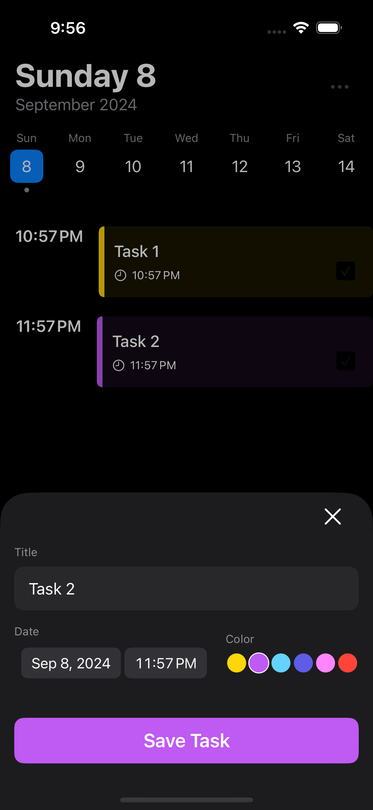

#TaskManager

**TaskManager** is a powerful yet easy-to-use task management app built with SwiftUI and SwiftData. The app offers an intuitive interface for managing tasks, including task creation, editing, and completion tracking. It also features a weekly calendar view to help visualize and organize tasks by date.

## Features

- **Task Creation & Editing**: Quickly add new tasks or modify existing ones with a simple, user-friendly interface.
- **Task List with Swipe Actions**: Easily mark tasks as complete or delete them with a swipe action.
- **Weekly Calendar View**: Visualize your tasks in a weekly layout, and navigate between previous, current, and upcoming weeks with a swipe.
- **Task Completion Tracking**: Check off tasks as completed directly from the task list view.
- **Custom Task Colors**: Assign different colors to your tasks for improved organization and quick visual identification.
- **Mock Data Support**: Add and remove mock tasks for testing and demo purposes through the settings menu.
- **Interactive Task Editing**: Open tasks for editing with a simple tap, and save changes in real-time.

## Screenshots



## Installation

1. Clone the repository:
    ```bash
    git clone https://github.com/yourusername/TaskManager.git
    ```

2. Open the project in Xcode:
    ```bash
    cd TaskManager
    open TaskManager.xcodeproj
    ```

3. Build and run the project on your simulator or device.

## Usage

1. **Creating a Task**: Tap the "+" button in the bottom-right corner to create a new task.
2. **Navigating Weeks**: Swipe left or right in the weekly view to navigate between previous, current, and future weeks.
3. **Editing/Deleting Tasks**: Swipe left on any task in the list to edit or delete it.
4. **Mock Data**: Use the ellipsis menu to add or remove mock tasks for testing.

## Contribution

Feel free to fork the project, open issues, or submit pull requests if you'd like to contribute or suggest improvements.

## License

This project is licensed under the MIT License - see the [LICENSE](LICENSE) file for details.

---

### Credit

This project was inspired by [Kavsoft's YouTube tutorial](https://www.youtube.com/watch?v=sbheMzA3jTI&t=5s). Big thanks to **Kavsoft** for their excellent content on SwiftUI development! You can follow them on Twitter at [@Kavsoft](https://twitter.com/Kavsoft).

